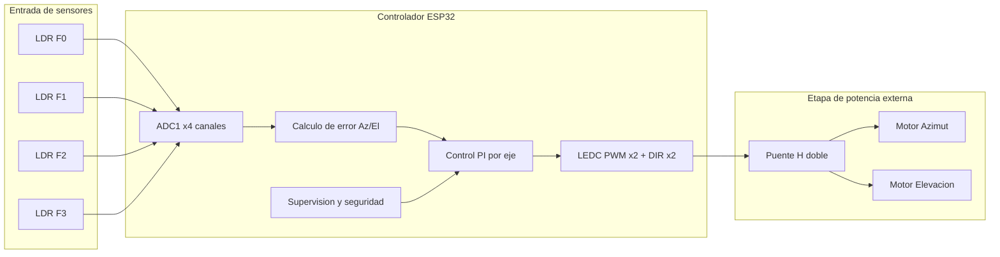
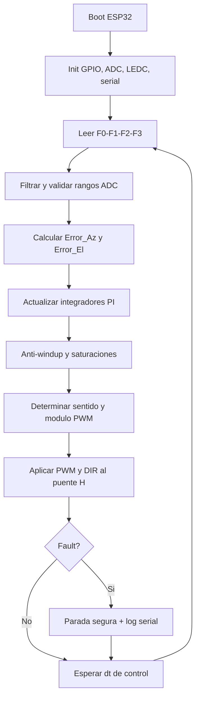

# Documento Tecnico TD2 - Migracion Sun Tracker a ESP32

Estado: borrador tecnico vigente para Tecnicas Digitales 2.  
Fecha: 2026-06-09.

## 1. Alcance y separacion de proyectos

Este documento cubre solo TD2: migracion del controlador del Sun Tracker viejo
(ATmega168/328) hacia ESP32.

Optoelectronica se considera finalizado y queda separado del alcance actual.
No se usa como base de diseno de control de motores.

## 2. Que informacion SI existe en la carpeta vieja

Fuente local verificada:

- `INFORMACION VIEJA/INFORMACION VIEJA/UNDEFI 263 - Informe Final.pdf`
- `INFORMACION VIEJA/INFORMACION VIEJA/Circuito Eléctrico/Sun_seeker.PDF`
- `INFORMACION VIEJA/INFORMACION VIEJA/Firmware/Sun Tracker/Sun Tracker/popo/popo/*.c`

Datos recuperables de forma confiable:

- Algoritmo de control PI por eje.
- Ecuaciones de error para azimut y elevacion.
- Constantes iniciales: `Kp=5.0`, `Ki=0.1`, `Kd=0.0`, `Reset_aw=400.0`.
- PWM de 10 bits (0..1023) y direccion por bit de sentido.
- Lectura de 4 sensores por ADC (canales 0..3 en AVR).

## 3. Que datos SIGUEN faltando para construccion final

No aparecen explicitamente en el firmware viejo:

- Definicion final del puente H a usar en el nuevo armado (si se conserva L298 o no).
- Tension real medida de motores en la maqueta actual (9 V o 12 V efectivos).
- Corriente de arranque/bloqueo de cada motor.
- Confirmacion de finales de carrera fisicos.
- Criterio de protecciones (fusible, corte por sobrecorriente, TVS, etc.).

## 4. Arquitectura objetivo (simulada para ESP32 + periferia)

Se modela una arquitectura de referencia para avanzar aun sin cerrar los faltantes.

## 5. Diagrama de flujo funcional

## 6. Mapa de componentes (modelo de trabajo)

| Bloque | Componente | Estado |
|---|---|---|
| Control | ESP32 DevKit (WROOM32) | Confirmado |
| Sensado | 4 x LDR + resistores de carga | Confirmado (por legado) |
| Potencia | Puente H doble | Pendiente eleccion final |
| Actuacion | 2 x motor DC (azimut/elevacion) | Confirmado |
| Alimentacion logica | 5V/3.3V regulada | Pendiente especificacion final |
| Seguridad | Fusible, proteccion corriente, E-stop | Pendiente |

## 7. Interfaz propuesta ESP32-periferia (simulada)

| Senal | Tipo | GPIO sugerido | Destino |
|---|---|---|---|
| F0 | ADC entrada | GPIO36 | LDR 0 |
| F1 | ADC entrada | GPIO39 | LDR 1 |
| F2 | ADC entrada | GPIO34 | LDR 2 |
| F3 | ADC entrada | GPIO35 | LDR 3 |
| PWM_AZ | PWM salida | GPIO25 | ENA / canal A puente H |
| PWM_EL | PWM salida | GPIO26 | ENB / canal B puente H |
| DIR_AZ | Digital salida | GPIO27 | IN_A sentido azimut |
| DIR_EL | Digital salida | GPIO14 | IN_B sentido elevacion |
| ESTADO | Digital salida | GPIO2 | LED debug |

Nota: son pines de referencia para desarrollo inicial. Se deben validar contra el
driver de potencia finalmente elegido.

## 8. Modelo matematico legado a preservar

Ecuaciones tomadas del firmware viejo:

$$
Error_{El} = \frac{(F2 + F3) - (F0 + F1)}{2}
$$

$$
Error_{Az} = \frac{(F1 + F3) - (F0 + F2)}{2}
$$

Ley PI discreta por eje:

$$
I_k = clamp(I_{k-1} + Error_k, -Reset_{aw}, Reset_{aw})
$$

$$
u_k = K_p\,Error_k + K_i\,I_k
$$

con saturacion de salida en el rango PWM permitido.

## 9. Criterio de avance aun con incertidumbre

Mientras faltan datos de hardware final, se puede avanzar en:

- Firmware base `main_tracker.cpp` con PI y HAL de pines desacoplado.
- Modo simulacion de sensores por serial para validar lazo de control.
- Pruebas con cargas de banco (sin mecanica) para PWM + sentido.

Se bloquea solamente:

- Ajuste final de ganancias en campo.
- Validacion termica/electrica de potencia.
- Definicion definitiva de limites de seguridad.
