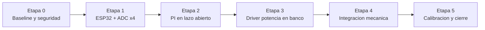
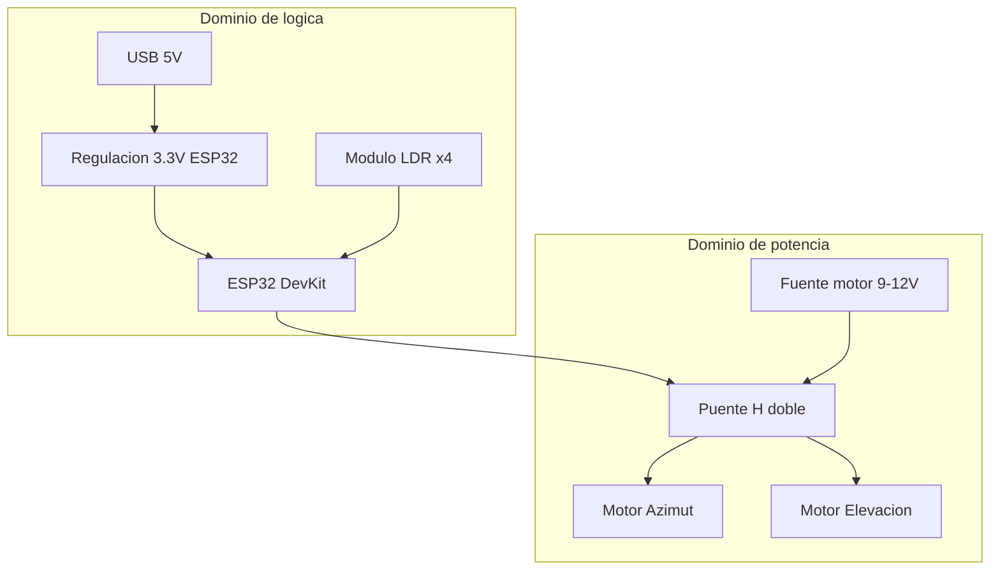

# Planmode TD2 - Armado y Puesta en Marcha Sun Tracker ESP32

Estado: plan operativo para ejecucion por etapas.  
Enfoque: prolijo, trazable y con validaciones tempranas.

## 1. Principio de trabajo

Objetivo: llegar a un sistema funcional por incrementos, evitando cableados grandes
sin validacion previa.

Regla: cada etapa cierra con evidencia medible antes de pasar a la siguiente.

## 2. Roadmap visual

## 3. Etapas detalladas

## Etapa 0 - Baseline y seguridad

Entregable:

- Banco ordenado, alimentacion definida, masas etiquetadas, plan de apagado.

Checklist:

- [ ] Separar alimentacion logica y potencia.
- [ ] Definir punto unico de GND comun.
- [ ] Incorporar fusible de entrada de potencia.
- [ ] Definir boton de paro rapido (al menos corte de EN del puente H).

Criterio de salida:

- Encendido/apagado seguro repetible sin reset espurio del ESP32.

## Etapa 1 - ESP32 + sensores LDR

Entregable:

- Lectura estable de F0-F1-F2-F3 por serial.

Checklist:

- [ ] Configurar ADC1 en 4 canales.
- [ ] Muestreo periodico a dt fijo (ej. 20 ms).
- [ ] Filtro simple (media movil corta).
- [ ] Identificar offset y rango util por canal.

Criterio de salida:

- Variacion coherente de canales al sombrear cada LDR por separado.

## Etapa 2 - Control PI en lazo abierto

Entregable:

- Calculo online de `errAz`, `errEl`, integradores y comandos `uAz/uEl` sin mover motores.

Checklist:

- [ ] Portar formulas de error del firmware AVR.
- [ ] Portar PI con anti-windup (`Reset_aw`).
- [ ] Saturacion de salida.
- [ ] Zona muerta configurable.

Criterio de salida:

- Telemetria serial estable y sin windup creciente ante error sostenido.

## Etapa 3 - Potencia en banco (sin estructura mecanica)

Entregable:

- PWM + direccion controlando ambos canales del puente H con carga de prueba.

Checklist:

- [ ] Verificar niveles logicos ESP32 a entradas del puente H.
- [ ] Probar cada eje por separado.
- [ ] Verificar que `DIR` invierte sentido real.
- [ ] Medir temperatura del driver en 10 min de prueba.

Criterio de salida:

- Control bidireccional estable sin sobrecalentamiento ni resets del ESP32.

## Etapa 4 - Integracion mecanica real

Entregable:

- Tracker moviendo azimut y elevacion con feedback LDR.

Checklist:

- [ ] Conectar motores reales y verificar consumo.
- [ ] Definir limites mecanicos.
- [ ] Implementar parada por timeout de movimiento.
- [ ] Verificar sentido correcto de cada eje respecto al error.

Criterio de salida:

- El sistema reduce error en ambos ejes desde posiciones iniciales distintas.

## Etapa 5 - Calibracion y cierre TD2

Entregable:

- Parametros finales, evidencias de prueba y version candidata de entrega.

Checklist:

- [ ] Ajuste fino de `Kp/Ki` por eje.
- [ ] Registro de estabilidad (sin oscilacion sostenida).
- [ ] Tabla final de pines y conexiones.
- [ ] Documentacion de seguridad y operacion.

Criterio de salida:

- Repetibilidad en 3 ciclos completos de prueba.

## 4. Vista de componentes del armado

## 5. Riesgos abiertos (por datos aun no definidos)

| Riesgo | Impacto | Mitigacion provisional |
|---|---|---|
| Puente H final no definido | Re-trabajo de pines y protecciones | Diseñar HAL de salidas desacoplada |
| Tension real de motor incierta | Sobrecalentamiento o bajo torque | Arrancar con fuente limitada y medir |
| Sin finales de carrera confirmados | Riesgo mecanico | Agregar timeout + parada manual |
| Corriente de arranque desconocida | Riesgo de danio en driver | Medicion previa con pinza o shunt |

## 6. Definition of Done (TD2)

- Firmware ESP32 controla dos ejes con PI estable.
- Cableado final documentado y etiquetado.
- Pruebas de seguridad ejecutadas y registradas.
- Documento tecnico de TD2 actualizado con valores finales reales.
